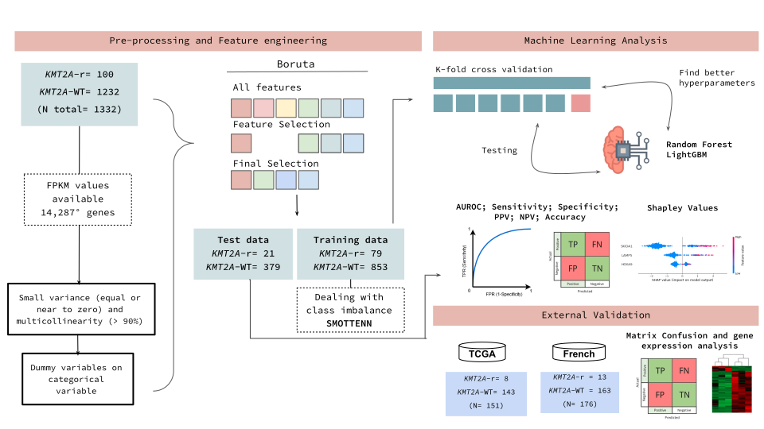
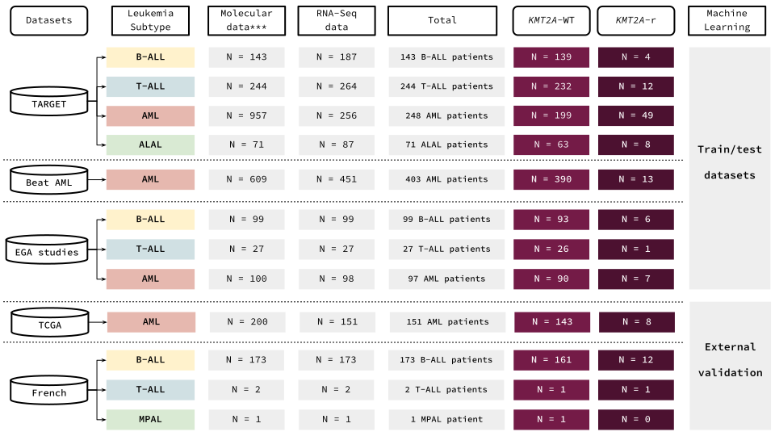

# Novel diagnostic and therapeutic options for KMT2A-rearranged acute leukemias

The KMT2A (MLL) gene rearrangements (KMT2A-r) are associated with a diverse spectrum of acute
leukemias. Although most KMT2A-r are restricted to nine partner genes, we have recently revealed
that KMT2A-USP2 fusions are often missed during FISH screening of these genetic alterations.
Therefore, complementary methods are important for appropriate detection of any KMT2A-r. Here we
use a machine learning model to unravel the most appropriate markers for prediction of KMT2A-r in
various types of acute leukemia.

## Workflow of Machine Learning analysis

## Scripts from the best models

`Batch_effect.R` & `Analysis_correlation.R`

First, we integrate the TARGET, Beat AML and EGA datasets and then remove
the batch effect using the study variable (dataset origin). After that, 
we remove the variables with high correlation (> 90%).

`KMT2Ar-preProcess&Boruta.ipynb`

Variance Analysis and feature selection with BorutaPy. 247 genes were considered 
important for predicting the KMT2A gene rearrangement.

`KMT2Ar-Development-247genes.py`

Development of the models using 247 genes selected by BorutaPy.

`KMT2Ar-Model_Analysis-247Genes.ipynb`

Analysis of the developed models (confusion matrix; metrics; ROC curve; Shap values).

## Datasets
The RData file - [`Dataset_ML_KMT2Ar.RData`](https://ndownloader.figshare.com/files/34965360) - available only contains the TARGET and Beat-AML data due to the control of the others (EGA studies).
Downloading and obtaining data are described in the materials and methods section of the paper.

Please cite: Lopes BA, Poubel CP, Teixeira CE, Caye-Eude A, Cavé H, Meyer C, Marschalek R, Boroni M and Emerenciano M (2022) Novel Diagnostic and Therapeutic Options
for KMT2A-Rearranged Acute Leukemias. Front. Pharmacol. 13:749472. doi: 10.3389/fphar.2022.749472.

---------------------------------------------------------------------------------------------------------

Bioinformatics and Computational Biology Laboratory (LBBC-INCA);
Brazilian National Cancer Institute (INCA-RJ) 
